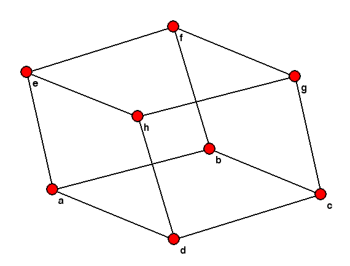
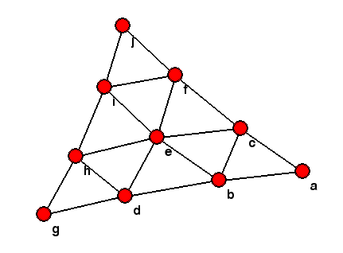
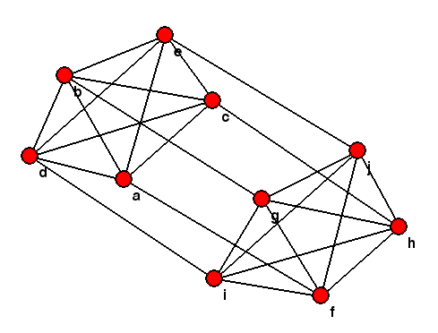
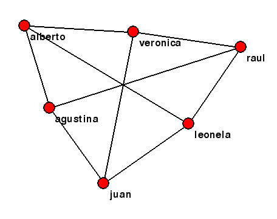
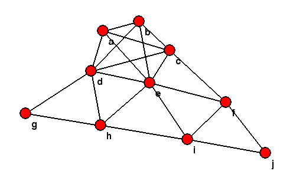
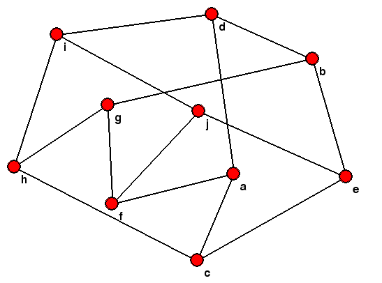

# Graficador de Grafos mediante Fruchterman-Reingold

## Uso

Primero, es necesario tener `pygame` instalado para usar este programa, se puede instalar mediante:

```
pip3 install pygame
```

Para usar el graficador, primero se debe escribir la descripción del grafo en un archivo. En la primer linea, debe haber dos enteros `n` y `m`, donde `n` es la cantidad de nodos y `m` es la cantidad de aristas. En las siguientes `n` lineas debe estar la etiqueta de cada nodo, y en las últimas m lineas debe estar la descripción de las aristas, una por linea, con las etiquetas de los dos nodos que conecta.

Para ver ejemplos, ir a `/data/dataXY.txt`. Para probarlo en alguno de los ejemplos, usar:

```
python3 fruchterman-reingold.py --path data/dataXY.txt
```

Reemplazando `XY` por lo que corresponda.

Las constantes y la cantidad de iteraciones están configuradas a lo que experimentalmente dio buenos resultados, pero en caso de querer cambiarlas, con las opciones `--atraccion` y `--repulsion` se puede indicar una constante distinta por la cual multiplicar las funciones de atracción y repulsión.

## Ejemplo

Estos son algunos de los resultados obtenidos:








Aunque, no siempre se obtiene la forma común con la que se conoce a cierto grafo, por ejemplo, el [grafo de Petersen](https://es.wikipedia.org/wiki/Grafo_de_Petersen), pero esto se debe a la naturaleza de los [algoritmos de dibujado de grafos mediante fuerzas](https://en.wikipedia.org/wiki/Force-directed_graph_drawing).


