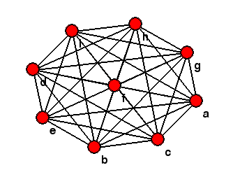

# Graph Drawer (using Fruchterman-Reingold)

## Usage

First, it is required to have `pygame` installed in your system, you can install it via:

```
pip3 install pygame
```

To use the drawer, you first have to write the description of the graph to a file. In the first line, there should be integers `n` and `m`, where `n` is the number of nodes and `m` is the number of edges. In the following `n` lines there should be tags for each node, and in the last m lines, there should be a description of each edge, one per line, with the tags of the nodes it connects.

To see some examples, go to `/data/dataXY.txt`. To test it with one of the examples, run:

```
python3 fruchterman-reingold.py --path data/dataXY.txt
```

Replacing `XY` with the example that you want to test.

The constants and the number of iterations are configured to what gave good results experimentally, but you can change them using the options `--atraccion` for attraction and `--repulsion` for repulsion.

## Example

These are some of the results obtained:





However, you don't always obtain the common picture with which a graph is known, as an example, the [Petersen graph](https://en.wikipedia.org/wiki/Petersen_graph), but this is a consequence of how the [force directed graph drawing algorithms](https://en.wikipedia.org/wiki/Force-directed_graph_drawing).


